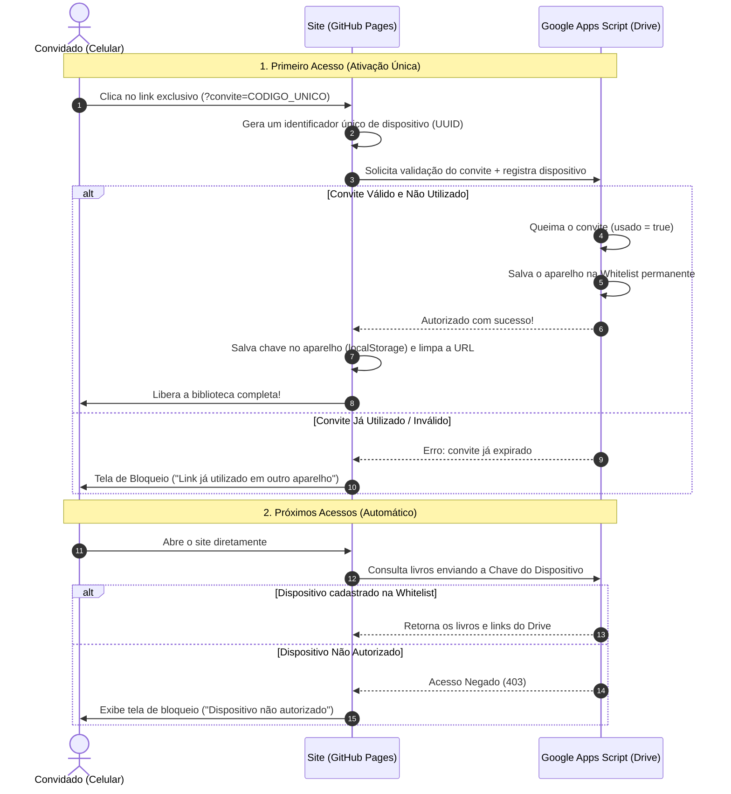

# 📚 Let's Be Readers — Status do Projeto

> **Conceito:** Biblioteca digital pessoal moderna para catálogo, busca e download de livros (EPUB, PDF) sincronizada em tempo real com o Google Drive.  
> **Repositório GitHub:** [github.com/GehardFernando/biblioteca-drive](https://github.com/GehardFernando/biblioteca-drive)  
> **Site no Ar (GitHub Pages):** [gehardfernando.github.io/biblioteca-drive](https://gehardfernando.github.io/biblioteca-drive/)  
> **Última Atualização:** 18 de Setembro de 2026  

---

## 📌 Status Atual: Fases Concluídas

### ✅ Fase 1: Design de Interface & Responsividade Mobile
- **Design System Dark Minimalista (Moderno & Tech):** Fundo obsidiana (`#0a0e17`), superfícies em grafite (`#111726`), efeitos de *glassmorphism*, ambient glow e sombras realistas nas capas.
- **Mobile-First & Ajuste de Dimensões:**
  - Travamento de overflow no `html` e `body` evitando zoom out indesejado em celulares.
  - Grade equilibrada em 2 colunas no smartphone com `min-width: 0` e quebra de títulos sem transbordamento.
  - Carrossel de categorias touch deslizável sem margens negativas que causem vazamento lateral.
  - Breakpoint expandido para 768px (tablets e smartphones) com regra extra para telas compactas `<= 420px`.
  - Suporte a `viewport-fit=cover` para entalhes/notches de iPhone e Android.

### ✅ Fase 2: Publicação & Integração com Google Drive
- **Versionamento no GitHub:** Repositório inicializado, `.gitignore` seguro protegendo arquivos pesados e branch `main` publicada.
- **Deploy no GitHub Pages:** Publicação automática online e acessível de qualquer dispositivo.
- **Sincronização em Tempo Real (Google Apps Script):**
  - Script [`google-drive-sync.gs`](./google-drive-sync.gs) conectado à pasta oficial do Drive (`1Cm-w4noHBr2FeF9ypnzgM6lAKvPob9Of`).
  - Catálogo de **579 livros** indexados e lidos diretamente do Google Drive.
  - Carregamento instantâneo via cache local (`localStorage`) no navegador do celular/PC.
  - Botão de **Sincronização Manual** no cabeçalho com animação e notificação toast.
  - Download direto dos arquivos pelo Google Drive.

---

## 📂 Arquivos do Projeto

| Arquivo | Descrição |
| :--- | :--- |
| [`index.html`](./index.html) | Estrutura semântica: header com busca instantânea, botão de sincronização, filtros, grid de livros e modal de detalhes. |
| [`style.css`](./style.css) | Sistema de design completo e responsivo (desktop, tablet, mobile) sem dependências externas. |
| [`app.js`](./app.js) | Lógica da aplicação: integração com Google Apps Script, cache, busca instantânea (`/`), paginação fluida e downloads. |
| [`google-drive-sync.gs`](./google-drive-sync.gs) | Script do Google Apps Script para leitura contínua e em tempo real da pasta do Google Drive. |
| [`scan_books.py`](./scan_books.py) | Indexador Python local para extração de capas em alta resolução de arquivos EPUB. |
| [`books.json`](./books.json) & [`books-data.js`](./books-data.js) | Base de dados estruturada com 579 livros e fallback offline. |
| [`capas/`](./capas/) | Diretório com mais de 560 capas reais extraídas dos livros. |
| [`.gitignore`](./.gitignore) | Proteção para não subir arquivos binários pesados de livros para o repositório Git. |
| [`PROJETO_STATUS.md`](./PROJETO_STATUS.md) | Documentação de status e arquitetura do projeto. |

---

## 🛡️ Próxima Etapa: Segurança & Controle de Acesso por Dispositivo

> **Objetivo:** Restringir o acesso à biblioteca para **apenas 3 pessoas**, garantindo que o acesso venha exclusivamente dos seus aparelhos físicos autorizados, sem risco de compartilhamento de links.

### Arquitetura Planejada: Convites de Uso Único (*One-Time Invite Links*) + Whitelist de Dispositivos



### Principais Características da Solução:
1. **O link queima no primeiro clique:** Cada pessoa recebe um link único (ex: `site.com/?convite=COD_AMIGO1`). Assim que o celular abre o link, o convite é invalidado no Google Apps Script. Se tentarem repassar o link em grupos ou para outras pessoas, ele não funcionará.
2. **Identificação por Aparelho:** O navegador do aparelho autorizado armazena um token criptográfico local. Apenas aquele celular/navegador consegue carregar a biblioteca.
3. **Tela de Bloqueio Elegante (Dark Glassmorphism):** Qualquer acesso que não possua dispositivo autorizado na whitelist se depara com uma tela de bloqueio informando que a biblioteca é privada.
4. **Proteção na API do Google Drive:** O script do Drive se recusa a entregar os livros e links se a requisição não vier de um dispositivo registrado na Whitelist.
5. **Gerenciamento Centralizado:** O proprietário pode resetar convites ou remover dispositivos a qualquer momento diretamente pelo Google Apps Script (`PropertiesService`).

---

## 🖥️ Como rodar e visualizar localmente

```bash
cd ~/biblioteca-drive
python3 -m http.server 3000
```
Acesse `http://localhost:3000` ou pelo IP local na sua rede Wi-Fi `http://192.168.15.20:3000`.
