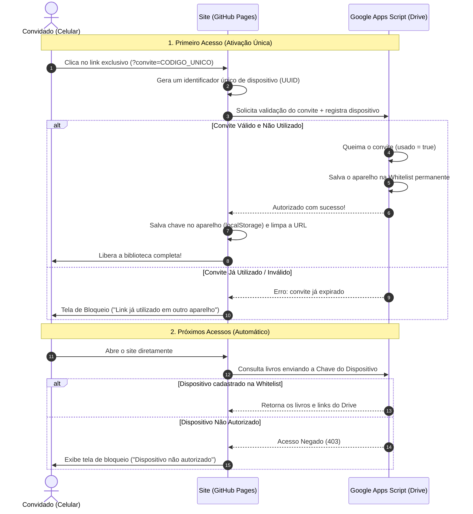

# 📚 Let's Be Readers — Status do Projeto

> **Conceito:** Biblioteca digital pessoal moderna para catálogo, busca e download de livros (EPUB, PDF) sincronizada em tempo real com o Google Drive.  
> **Repositório GitHub:** [github.com/GehardFernando/biblioteca-drive](https://github.com/GehardFernando/biblioteca-drive)  
> **Site no Ar (GitHub Pages):** [gehardfernando.github.io/biblioteca-drive](https://gehardfernando.github.io/biblioteca-drive/)  
> **Última Atualização:** 19 de Setembro de 2026  

---

## 📌 Status Atual: Fases Concluídas

### ✅ Fase 1: Design de Interface & Responsividade Mobile
- **Design System Dark Minimalista (Moderno & Tech):** Fundo obsidiana (`#0a0e17`), superfícies em grafite (`#111726`), efeitos de *glassmorphism*, ambient glow e sombras realistas nas capas.
- **Mobile-First & Ajuste de Dimensões:**
  - Travamento de overflow no `html` e `body` evitando zoom out indesejado em celulares.
  - Grade equilibrada em 2 colunas no smartphone com `min-width: 0` e quebra de títulos sem transbordamento.
  - Carrossel de categorias touch deslizável sem margens negativas que causem vazamento lateral.
  - Breakpoint expandido para 768px (tablets e smartphones) com regra extra para telas compactas `<= 420px`.
  - Suporte a `viewport-fit=cover` para entalhes/notches de iPhone e Android.

### ✅ Fase 2: Publicação & Integração com Google Drive
- **Versionamento no GitHub:** Repositório inicializado, `.gitignore` seguro protegendo arquivos pesados e branch `main` publicada.
- **Deploy no GitHub Pages:** Publicação automática online e acessível de qualquer dispositivo.
- **Sincronização em Tempo Real (Google Apps Script):**
  - Script [`google-drive-sync.gs`](./google-drive-sync.gs) conectado à pasta oficial do Drive (`1Cm-w4noHBr2FeF9ypnzgM6lAKvPob9Of`).
  - Catálogo de **661 livros** indexados e organizados (com 120 livros em inglês devidamente etiquetados).
  - Carregamento instantâneo via cache local (`localStorage`) no navegador do celular/PC.
  - Botão de **Sincronização Manual** no cabeçalho com animação e notificação toast.
  - Download direto dos arquivos pelo Google Drive e servidor local.

### ✅ Fase 3: Organização, Deduplicação & Padronização de Nomes
- **Deduplicação Completa:** 39 livros duplicados/repetitivos removidos após análise minuciosa de integridade binária (MD5) e conteúdo textual.
- **Padronização Canônica:** 100% dos 661 livros renomeados para o padrão formal `<Título> - <Autor>.epub`.
- **Identificação de Idioma:** Detecção de texto e metadados identificou 120 obras em língua inglesa, padronizadas com a etiqueta `(English)` no nome do arquivo (`<Título> - <Autor> (English).epub`).
- **Reindexação Total:** Execução do [`scan_books.py`](./scan_books.py) atualizando [`books.json`](./books.json), [`books-data.js`](./books-data.js) e mais de 640 capas reais em [`capas/`](./capas/).

### ✅ Fase 4: Integração com Amazon Send to Kindle
- **Botão Dedicado no Modal de Detalhes:** Acesso direto para envio de qualquer obra para o leitor físico ou aplicativo Kindle.
- **Fluxo Assistido em 1 Clique:** Dispara o download seguro do EPUB e abre automaticamente a página oficial do Amazon Send to Kindle (`amazon.com.br/sendtokindle` ou `amazon.com/sendtokindle`).
- **Envio por E-mail do Kindle (`@kindle.com`):** Campo persistente no `localStorage` para quem prefere envio automático por e-mail com assunto e corpo pré-formatados.
- **Atalho no Cabeçalho:** Acesso rápido ao portal Send to Kindle no topo da página.

### ✅ Fase 5: Correção Definitiva de Capas & Nomes Determinísticos
- **Nomes de Capas Determinísticos e Imutáveis:** Nomes de capa e IDs gerados via hash SHA-256 do arquivo (`cov_<hash>.<ext>`), blindando o catálogo contra descompassos mesmo que livros sejam adicionados ou removidos.
- **Extração e Auditoria 100% Precisas:** 646 capas extraídas diretamente do interior de cada EPUB atual. Expurgadas 779 capas legadas e órfãs. Auditoria automatizada confirmou 0 capas trocadas.

### ✅ Fase 6: Cobertura de 100% das Capas do Catálogo & Invalidação de Cache v5
- **100% dos Livros com Capas Reais:** Os 15 títulos que estavam pendentes de capa foram completamente solucionados:
  - Extração profunda de capas em alta resolução no interior dos EPUBs (*Patinando no Amor* 300 DPI, *O Maravilhoso Livro das Meninas*, *A Saga de Darren Shan 4*, *Julie & Julia*, *Mais Comédias Para Ler na Escola*, *Como Enxergar Bem Sem Óculos*, *Dias Melhores Virão*).
  - Reparo e extração via 7z para arquivos com cabeçalhos atípicos (*Desculpa Se Te Chamo de Amor*).
  - Integração de capas oficiais brasileiras de alta definição para obras sem arte embutida (*Dexter: A Mão Esquerda de Deus*, *White Fang*, *Aliviando a Bagagem*, *Nas Garras da Graça*, *A Grande Casa de Deus*, *O Novo Mundo Digital*).
  - Capa editorial personalizada para o compilado *Artigos Selecionados (Instapaper 2011)*.
- **Índice Perfeito:** 661 livros catalogados, 661 com capa válida em disco (0 livros sem capa).
- **Sanitização de Títulos:** Correção de falhas legadas de codificação de caracteres em títulos do acervo.
- **Invalidação Proativa de Cache (v5):**
  - Cache local atualizado para `drive_books_cache_v5` com limpeza automática de versões legadas (`v1` a `v4`).
  - Atualização dos parâmetros `?v=20260919_v5` no `index.html` garantindo visualização instantânea em celulares e computadores.

---

## 📂 Arquivos do Projeto

| Arquivo | Descrição |
| :--- | :--- |
| [`index.html`](./index.html) | Estrutura semântica: header com busca instantânea, botão de sincronização, filtros, grid de livros e modal de detalhes. |
| [`style.css`](./style.css) | Sistema de design completo e responsivo (desktop, tablet, mobile) sem dependências externas. |
| [`app.js`](./app.js) | Lógica da aplicação: integração com Google Apps Script, cache v5, busca instantânea, paginação fluida e downloads. |
| [`google-drive-sync.gs`](./google-drive-sync.gs) | Script do Google Apps Script para leitura contínua e em tempo real da pasta do Google Drive. |
| [`scan_books.py`](./scan_books.py) | Indexador Python com extração profunda e resiliente de capas. |
| [`books.json`](./books.json) & [`books-data.js`](./books-data.js) | Base de dados estruturada com 661 livros e 100% de capas cobertas. |
| [`capas/`](./capas/) | Diretório com 661 capas reais indexadas deterministicamente por hash SHA-256. |
| [`.gitignore`](./.gitignore) | Proteção para não subir arquivos binários pesados de livros para o repositório Git. |
| [`PROJETO_STATUS.md`](./PROJETO_STATUS.md) | Documentação de status e arquitetura do projeto. |

---

## 🛡️ Próxima Etapa: Segurança & Controle de Acesso por Dispositivo

> **Objetivo:** Restringir o acesso à biblioteca para **apenas 3 pessoas**, garantindo que o acesso venha exclusivamente dos seus aparelhos físicos autorizados, sem risco de compartilhamento de links.

### Arquitetura Planejada: Convites de Uso Único (*One-Time Invite Links*) + Whitelist de Dispositivos



### Principais Características da Solução:
1. **O link queima no primeiro clique:** Cada pessoa recebe um link único (ex: `site.com/?convite=COD_AMIGO1`). Assim que o celular abre o link, o convite é invalidado no Google Apps Script. Se tentarem repassar o link em grupos ou para outras pessoas, ele não funcionará.
2. **Identificação por Aparelho:** O navegador do aparelho autorizado armazena um token criptográfico local. Apenas aquele celular/navegador consegue carregar a biblioteca.
3. **Tela de Bloqueio Elegante (Dark Glassmorphism):** Qualquer acesso que não possua dispositivo autorizado na whitelist se depara com uma tela de bloqueio informando que a biblioteca é privada.
4. **Proteção na API do Google Drive:** O script do Drive se recusa a entregar os livros e links se a requisição não vier de um dispositivo registrado na Whitelist.
5. **Gerenciamento Centralizado:** O proprietário pode resetar convites ou remover dispositivos a qualquer momento diretamente pelo Google Apps Script (`PropertiesService`).

---

## 📲 Próxima Atividade: Integração com WhatsApp para Pedidos de Livros & Fila de Aquisições

> **Conceito:** Permitir que os usuários solicitem novas obras diretamente pelo site com abertura automática do WhatsApp, alimentando uma lista organizada de livros pendentes para download, indexação e inclusão no acervo.

```mermaid
flowchart LR
    A[Usuário pesquisa livro não encontrado] --> B[Clica em 'Pedir Livro via WhatsApp']
    B --> C[Modal com Título / Autor pré-preenchidos]
    C --> D[Gera mensagem formatada no WhatsApp]
    D --> E[Administrador recebe o pedido]
    E --> F[Adiciona à Fila de Aquisições / Downloads]
    F --> G[Download do EPUB + scan_books.py]
    G --> H[Livro entra no Drive e no Site automaticamente]
```



### 1. Funcionalidades Planejadas no Site:
- **Botão de Solicitação no Header / Navbar:**
  - Botão com ícone oficial do WhatsApp (`Pedir Livro`) integrado de forma harmônica com o botão do Kindle.
- **Integração com a Busca (Empty State Ativo):**
  - Quando a busca não retornar resultados, a tela exibe um Call-to-Action inteligente:
    *"Não encontrou o que procurava? Clique aqui para pedir este livro pelo WhatsApp!"*
  - O termo pesquisado é inserido automaticamente no campo de título do pedido.
- **Modal de Pedido Rápido (`#requestBookModal`):**
  - Campos: *Título da Obra*, *Autor (opcional)*, *Formato preferido (EPUB/PDF)* e *Observações*.
  - Botão de envio que compõe o link direto `https://wa.me/SEU_NUMERO?text=...` devidamente codificado (`encodeURIComponent`).

### 2. Formato da Mensagem Gerada para o WhatsApp:
```text
📚 *Novo Pedido de Livro — Let's Be Readers*
────────────────────────
📖 *Título:* O Nome do Vento
✍️ *Autor:* Patrick Rothfuss
📱 *Formato:* EPUB
💬 *Nota:* Gostaria de ler no meu Kindle!
────────────────────────
Enviado pela biblioteca digital pessoal.
```

### 3. Fila de Aquisições & Processamento:
- **Lista de Pedidos Pendentes:** Criação de um arquivo Markdown de acompanhamento (`PEDIDOS_PENDENTES.md`) ou integração opcional com aba no Google Planilhas via Apps Script.
- **Fluxo Operacional de Inclusão:**
  1. O administrador baixa o livro solicitado na pasta local `~/Downloads/Livros`.
  2. Executa `python3 scan_books.py` para gerar a capa determinística e atualizar o catálogo.
  3. O arquivo sincroniza com a pasta do Google Drive (`google-drive-sync.gs`).
  4. O livro fica disponível imediatamente para todos os usuários autorizados.

---

## 🖥️ Como rodar e visualizar localmente

```bash
cd ~/biblioteca-drive
python3 -m http.server 3000
```
Acesse `http://localhost:3000` ou pelo IP local na sua rede Wi-Fi `http://192.168.15.20:3000`.
